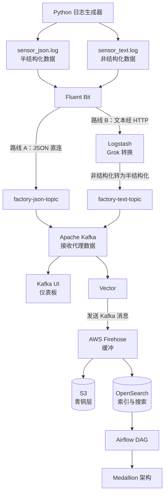

# 目标
- 理解、使用和应用 Kafka
- 在 ELK、EFK 中：
    - 负责数据传输、过滤、预处理等工作
        - L：Logstash -> 利用相关库，将非结构化数据（文本日志文件）加工后以 JSON 格式传输
        - F：Fluent Bit -> 传输 JSON 或文本数据
        - 传感器设备及其他设备（批量部署）产生日志后，立即通过 Fluent Bit/Logstash 传输到 Kafka，再依次经由 Vector、Firehose 进入 OpenSearch/S3，供搜索服务使用
- OpenSearch
    - Elasticsearch 的 AWS 版本（采用开放版权的版本）
    - 用于搜索引擎和索引查询
    - OpenSearch Dashboard 对应 Kibana

# 目标系统

```mermaid
flowchart LR
    subgraph SOURCE[数据源]
        PY[Python<br/>log_gen.py]
        LOGS["/sensor_logs/*.log"]
        PY -->|写入文件| LOGS
    end

    subgraph INGESTION[数据采集]
        FB[Fluent Bit<br/>代理]
        LS[Logstash]
    end

    subgraph TRANSFORM[数据转换]
        GROK[Grok<br/>模式匹配与字段提取]
        MUTATE[Mutate<br/>字符串转浮点数]
        TAG[Tagging<br/>添加告警元数据]
        GROK --> MUTATE --> TAG
    end

    subgraph MESSAGING[消息传递]
        JSON_TOPIC[factory-json-topic]
        TEXT_TOPIC[factory-text-topic]
        KAFKA[Kafka / MSK<br/>消息代理]
        JSON_TOPIC --> KAFKA
        TEXT_TOPIC --> KAFKA
    end

    subgraph VISUALIZE[检索与可视化]
        OS[(OpenSearch)]
        DASH[Dashboard / Kibana]
        OS <-->|建立索引与搜索| DASH
    end

    LOGS -->|持续读取，共享卷| FB
    FB -->|通道 A：JSON 直连| JSON_TOPIC
    FB -->|通道 B：HTTP 转发| LS
    LS --> GROK
    TAG -->|处理后的数据| TEXT_TOPIC
    KAFKA --> CONNECT[Kafka Connect / UI]
    CONNECT --> OS
```


数据从 Python 生成的两类日志出发，经 Fluent Bit 后可选择以下两条路线：



> 说明：两条采集路线是概念设计，实际运行时只选择其中一条。Kafka 可部署在 EC2、Kubernetes 等环境中，也可直接使用 AWS MSK。

# 开发环境配置
- 配置 docker-compose.yaml
```
    docker compose up -d
```

- Kafka 与 Kinesis
    - Kafka 是为处理大规模实时数据而构建的开源分布式事件流平台
    - 核心概念包括生产者、消费者和主题
    - 适合毫秒级、超低延迟的数据传输
    - AWS 以 MSK 服务的形式提供 Kafka
    - 使用较新的方式进行配置

- Fluentd（40～60 MB）与 Fluent Bit（1～5 MB）
    - 基于标签的路由工具
    - Fluentd 采用 Ruby 与 C 结合的结构；Fluent Bit 使用 C
    - 完成服务设置后，主要通过 fluent-bit.conf 进行配置
    - Fluent Bit 的用途
        - 收集、处理和传递数据（ETL 工具）
        - 轻量级开源日志处理器
        - 具有高可用性、高性能处理和稳定的数据处理能力等优点
        - 输入流支持文件、缓冲、路由等大多数常见来源
        - 输出流支持 Kafka、OpenSearch、S3 等大多数服务
            - 可利用相应的插件
    - 修改 fluent-bit.conf 后执行 docker compose restart，使修改生效
        - 也可以先停止并删除现有容器，再重新启动：
          ```powershell
          docker compose down
          docker compose up -d
          ```
    - 测试
      ```powershell
      # 持续查看 Fluent Bit 日志
      docker logs -f fluent-bit

      # 运行日志生成器
      python log_gen.py
      ```

# Kafka 测试
- 进入 Kafka 容器并创建 Topic
  ```sh
  # 进入容器
  docker container exec -it kafka-local bash

  # 创建名为 spacex 的 Topic
  sh /opt/kafka/bin/kafka-topics.sh --create --topic spacex --bootstrap-server 127.0.0.1:9092 --partitions 1 --replication-factor 1

  # 启动生产者；输入消息并按 Enter 即可发送
  sh /opt/kafka/bin/kafka-console-producer.sh --topic spacex --bootstrap-server 127.0.0.1:9092

  # 启动消费者，接收 spacex Topic 的消息
  sh /opt/kafka/bin/kafka-console-consumer.sh --topic spacex --bootstrap-server 127.0.0.1:9092
  ```

上述 Topic 配置表示：创建一个名为 `spacex` 的 Topic，使用 1 个分区和 1 个副本，并连接容器内 `127.0.0.1:9092` 上的 Kafka Broker。

- 测试接收 Fluent Bit 发送的传感器消息
  ```sh
  sh /opt/kafka/bin/kafka-console-consumer.sh --topic factory-json-topic --bootstrap-server 127.0.0.1:9092
  ```
